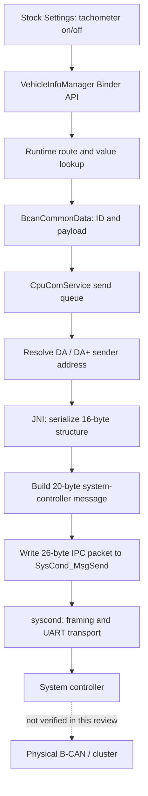

# Honda tachometer: command insertion and transport trace

## Result and boundary

The reviewed Honda head unit constructs a real vehicle customization message. The setting ID is the input to that construction, not the final command. This review traces the stock tachometer toggle through Android, JNI, the system-controller IPC packet, and the daemon's UART framing routine.

**The remaining unverified boundary is the system-controller firmware and physical vehicle bus/OBD routing.** No OBD adapter, live bus capture, or vehicle was used. The bytes below are conditional reconstructions of this firmware's code, not a tested procedure for changing a car.

## Call path



## 1. UI and Binder entry

`SystemSettingActivity.requestTachometerSettingChange` first calls the unit-information wrapper's `setTachometer`, then constructs `CustomizeSettingData`:

| Field | Value |
|---|---|
| Category | `0x03` |
| Setting ID | `0x5C` |
| API value for on | `1` |
| API value for off | `2` |

It calls `requestCustomizeMode` according to driving state and then `requestCustomizeSettingChange`. The latter is Binder transaction `0x53` on `IVehicleInfoManagerApService`. This number is only meaningful to Android Binder.

The Binder Parcelable order is category, ID, value, data type, data-range int array, FOB-key boolean array. A client should use the service's actual interface and callback lifecycle, rather than treating a transaction number as a vehicle protocol instruction.

## 2. Where the setting is inserted into the vehicle message

`CustomizeSettingControl.getInfoFrom(3,0x5C)` resolves **source `0x50`, menu `0x2E`** if the runtime source set supports it. `getListValue` converts the API value through the XML: on `1 → 0`, off `2 → 1`.

`VehicleInfoManagerApService$7.requestCustomizeSettingChange` builds:

| Field | Conditional value |
|---|---|
| Method, cycle time, vendor format | `0, 0, 0` |
| Data length | `3` |
| B-CAN ID for DA | `0x16305054` |
| B-CAN ID for DA+ | `0x16305055` |
| Payload for on | `40 2E 00` |
| Payload for off | `40 2E 01` |

The Java backing byte array has eight bytes, zero-filled beyond the three meaningful bytes. The native transport copies all eight while carrying the separate length field.

**This is the insertion point:** the menu goes into payload byte 1, and the translated value goes into payload byte 2. The original ID `0x5C` is no longer present in that payload. The ID formula is `0x16300054/55 + (source << 8)`.

Do not infer an adapter's standard/extended-frame flag from Honda's vendor `format=0`; its meaning is part of the proprietary transport.

## 3. Queue and sender-address correction

`CpuComService$1.notifyBcanCustomFrame` calls `setBcanWaitQue`, which copies the request into `CpuComBcanQueue` and queues it for `BcanSendThread`.

`isBcanDaWait` recognizes IDs with upper word `0x1630` and low byte `0x54` or `0x55`. These wait for DA/DA+ identification. Before sending, `setDaBcanID` replaces the low byte with `0x54` when `mDaPlusJudge=0`, or `0x55` when it is 1. Thus the earlier `getNavi()` choice is not necessarily the final sender byte.

The thread also waits for send-result state when required. It invokes native `doNotifyBcanData`. `notifyVehicleCustomize`, used for mode/indirect requests, enters the same queue.

## 4. JNI serialization

Library: `libcpu_com_service_jni.so`. Functions and virtual addresses:

- `setNotifyBcanData`: `0xD7F4`
- JNI `doNotifyBcanData`: `0xD9E4`
- `cpu_com_send_notify_bcan_data_common`: `0x1F640`
- `cpu_com_send_notify_bcan_data`: `0x1F6B0`
- `send_syscon_message`: `0x1F21C`

Disassembly must use **Thumb mode**. Default ARM decoding produces incorrect instructions for these functions.

`setNotifyBcanData` resolves the actual Java fields by name and builds this 16-byte native structure:

| Offset | Contents |
|---|---|
| 0 | Method |
| 1–2 | Cycle time, high byte first |
| 3 | Data length |
| 4 | `(format << 7) OR (BcanId >> 24)`, truncated to byte |
| 5–7 | Remaining BcanId bytes, high byte first |
| 8–15 | Eight backing payload bytes |

`cpu_com_send_notify_bcan_data_common` creates a 20-byte body beginning `51 07 44 00`, then copies the native structure (masking method to its low nibble).

For **on, DA**, that body is:

```text
51 07 44 00  00 00 00 03  16 30 50 54  40 2E 00 00 00 00 00 00
```

`send_syscon_message` wraps it in a separate IPC frame:

```text
02 00 15 FF EA  51 07 44 00 00 00 00 03 16 30 50 54 40 2E 00 00 00 00 00 00  03
```

Here `02` is the start byte, `00 15` is body length plus the final byte, `FF EA` is the bytewise complement of that length, and `03` is the end byte. The code opens `/dev/socket/SysCond_MsgSend` with `open(...,1)` and uses `write`. Despite the pathname, this function is not using a TCP/OBD socket.

These 26 bytes belong to the **head unit's internal IPC interface**. They are not a CAN frame payload and not an ELM-style scanner command.

## 5. Daemon and hardware boundary

The update contains `/system/bin/syscond`. Its default UART device string is `/dev/ttyHS3`; it also has a separate SPI path with `/dev/spidev1.1` and `SysCond_SpiMsg`.

The UART send routine at `0x3E1C` is identified by its `SysConUart_Send` log references. The message-processing code calls it at `0x1C86`. For a short body of length N, this routine constructs:

```text
02 | N+2 | body | 03 | checksum
```

The checksum is the byte sum modulo 256 of the start byte, length byte, and body; it excludes the trailing `03`. Larger bodies use another layout. The UART state machine includes acknowledgement/retry behavior; the write helper at `0x34A0` calls `write` for one byte. This is a second framing layer, distinct from the IPC framing above.

The exact daemon parsing/state-machine behavior has not been emulated end to end. In particular, do not assume writing the IPC bytes directly to a UART reproduces a valid session.

The outer update also contains `H6MP00E7.aud` (1,224,960 bytes), with header `H/W VERSION INFO` and `Ukulele`, and `syscomver.txt` with `*0.E7.00;H6*F00`. These are preserved as a system-controller firmware candidate and version evidence. Its machine-code architecture, container layout, CAN controller setup, and gateway behavior have **not** been established. Therefore this trace does not establish physical bus rate, connector pins, or reachability through an OBD port.

## 6. Response validation

`VehicleInfoManagerApService$5.onBcanCustomFrame` requires receive state 3 and validates the incoming address against the selected DA/DA+ destination. It extracts the source from the low ID byte and the menu from payload byte 1.

The setting-change response path requires an active change timer, matching source/menu, and outstanding request kind `0x67`. It compares the returned menu/value bytes with the saved request. On a match it updates cached values through `setValuesDirect` and calls `sendCustomizeSettingChange(0,1)`; a mismatch reports failure. The stock UI then processes the result callback and refreshes capability/value information.

A transport send acknowledgement, a Binder return, and a confirmed setting change are separate events.

## Where an implementation belongs

| Target | Appropriate integration point | Still needed |
|---|---|---|
| Original Honda head unit | VehicleInfoManager Binder API and callbacks | Service access/permissions and live capabilities |
| Cabin on TEYES/FYT | Verified SYU/vendor transport | Mapping to equivalent vehicle commands |
| OBD adapter/scanner | Adapter-specific vehicle-bus interface | Adapter capabilities, physical/gateway access, session protocol, live validation |

No generic OBD insertion instruction has been established. This does not prove an OBD route is impossible; it means the reviewed head-unit path does not itself supply one.

## Saved evidence and verification

- `offline_tachometer_trace.py` reconstructs on/off, DA/DA+ examples without opening any vehicle, serial, or network interface.
- Checked a full 26-byte IPC example against the decoded instruction layout, and checked on/off mapping and 16/20/26-byte lengths. These are static checks, not hardware tests.
- `native/cpu-jni-thumb.txt` and `native/syscond-thumb.txt` preserve disassembly; `native/sha256.json` records evidence checksums.
- `decompiled/CpuComService/` and `decompiled/CpuComServiceLib/` preserve recovered service/transport classes.
- Earlier evidence remains in `customization-review.md`, the XML, and the VehicleInfoManager/DaSettings smali trees.
